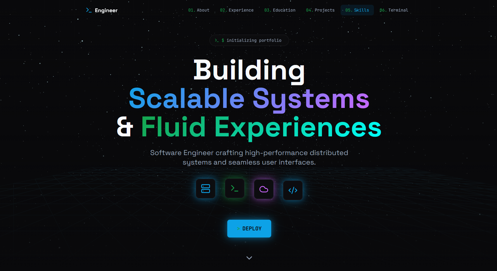

# ⚡ Lakshman | Full Stack & DevOps Portfolio



> **Building scalable systems and fluid experiences. A journey through code, cloud, and creativity.**

[](https://reactjs.org/)
[](https://vitejs.dev/)
[](https://www.typescriptlang.org/)
[](https://tailwindcss.com/)
[](https://docs.pmnd.rs/react-three-fiber)
[](https://opensource.org/licenses/MIT)

## 🚀 Overview

Welcome to my portfolio v2. This project is a showcase of my skills as a **Full Stack & DevOps Engineer**. It goes beyond a simple static page, featuring an **interactive terminal**, **3D immersive elements**, and **smooth, hardware-accelerated animations**.

Built with modern web technologies, it demonstrates a commitment to performance, accessibility, and high-quality user experience.

## ✨ Key Features

- **💻 Interactive Terminal**: A fully functional command-line interface simulation that allows you to "run" commands to navigate the site and view system stats.
- **🌐 Immersive 3D Experience**: Integrated `React Three Fiber` scenes with dynamic lighting and floating elements to create depth.
- **🛹 Smooth Horizontal Scrolling**: Enhanced project showcase using `Lenis` for buttery smooth scroll inertia.
- **🔗 Network Particle Background**: A dynamic, interactive background reflecting connectivity and complex systems.
- **📊 Interactive Data Visualization**: Skills and experience visualized with `Recharts` and animated counters.
- **🎨 Glassmorphism & Dark Mode**: A premium, dark-themed UI with glass effects and modern typography.

## 🛠️ Tech Stack

### Core
- **Framework**: [React 18](https://react.dev/)
- **Build Tool**: [Vite](https://vitejs.dev/)
- **Language**: [TypeScript](https://www.typescriptlang.org/)

### Design & UI
- **Styling**: [Tailwind CSS](https://tailwindcss.com/)
- **Components**: [shadcn/ui](https://ui.shadcn.com/) (Radix UI)
- **Icons**: [Lucide React](https://lucide.dev/), [React Icons](https://react-icons.github.io/react-icons/)
- **Fonts**: Inter, JetBrains Mono (for Terminal)

### Animation & 3D
- **3D Engine**: [@react-three/fiber](https://docs.pmnd.rs/react-three-fiber), [@react-three/drei](https://github.com/pmndrs/drei)
- **Animations**: [Framer Motion](https://www.framer.com/motion/)
- **Smooth Scroll**: [Lenis](https://lenis.studio/)

## 📂 Project Structure

```bash
src/
├── components/        # UI Building Blocks
│   ├── ui/            # Reusable primitive components (shadcn)
│   ├── TerminalSection.tsx  # Interactive Terminal Logic
│   ├── Scene3D.tsx         # R3F Canvas & 3D Objects
│   ├── ProjectsSection.tsx # Horizontal Scroll Container
│   └── ...
├── hooks/             # Custom React Hooks
├── lib/               # Utilities & Helpers
├── pages/             # Route Pages
└── style/             # Global Styles
```

## ⚡ Getting Started

### Prerequisites
- Node.js (v18 or higher)
- npm or yarn

### Installation

1. **Clone the repository**
   ```bash
   git clone https://github.com/your-username/portfolio-v2.git
   cd portfolio-v2
   ```

2. **Install dependencies**
   ```bash
   npm install
   ```

3. **Start the development server**
   ```bash
   npm run dev
   ```

4. **Build for production**
   ```bash
   npm run build
   ```

## 📝 License

This project is open source and available under the [MIT License](LICENSE).

---
<p align="center">
  Built with ❤️ by <strong>Lakshman</strong>
</p>
